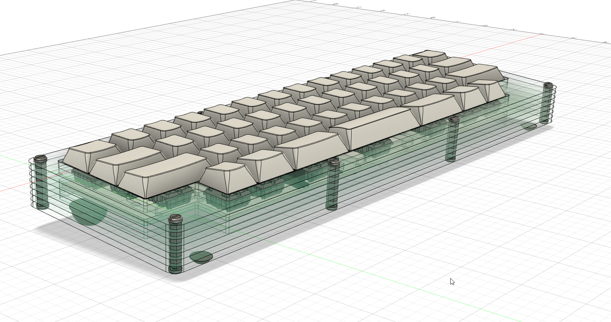

# Case

`sheet.dxf` is a file ready for Ponoko or similar cutting services. Kerf is not accounted for in any of the dxf files.

# Hardware

- Screws: https://www.mcmaster.com/94270A116/
- Standoffs x8: https://www.mcmaster.com/92080A010/

### Optional Bumpons:
- Back: https://www.mcmaster.com/95495K71/
- Front: https://www.mcmaster.com/95495K819/

## Alternate hardware
### Use these for a low profile look without the two top case layers

- Screws: https://www.mcmaster.com/92942A806/
- Standoffs x8: https://www.mcmaster.com/95947A010/